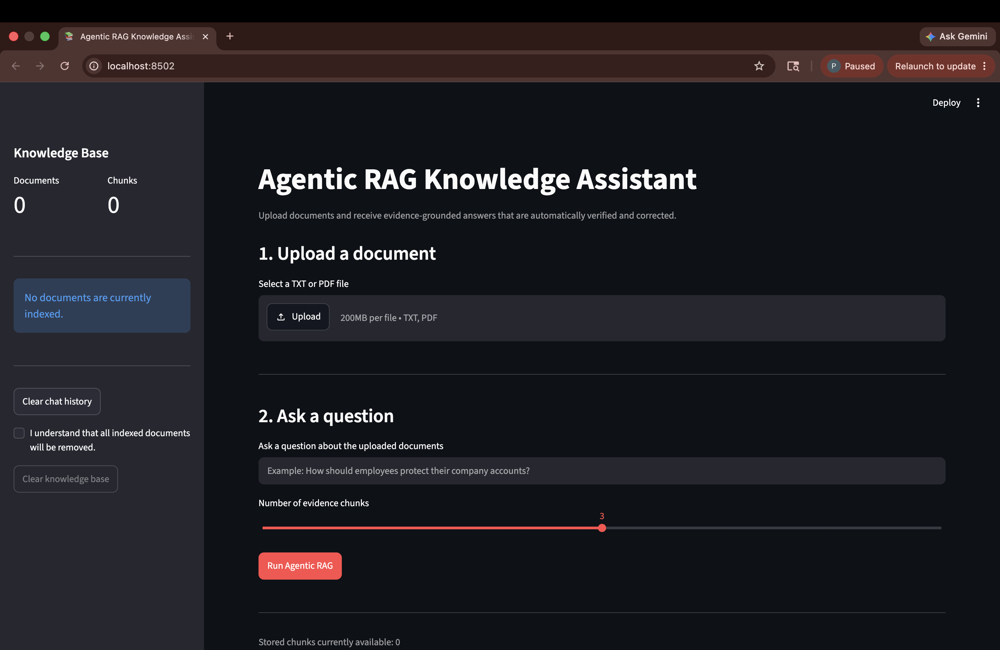
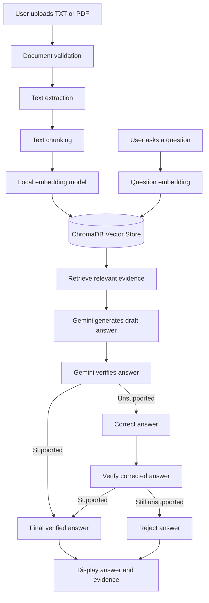

# Agentic RAG Knowledge Assistant

An AI-powered knowledge assistant that answers questions using information from uploaded TXT and PDF documents.

The system retrieves relevant document evidence, generates an answer using Google Gemini, verifies whether the answer is supported, and corrects or rejects unsupported responses through a LangGraph workflow.

## Application Preview



## Project Overview

Large Language Models can sometimes provide answers using general knowledge or generate unsupported information. This project reduces that problem using Retrieval-Augmented Generation, commonly known as RAG.

Instead of asking Gemini to answer directly, the application first searches documents uploaded by the user. Only the most relevant document sections are provided to Gemini as evidence.

The project also includes an agentic verification workflow. After an answer is generated, another step checks whether every factual claim is supported by the retrieved evidence. Unsupported answers are corrected once and verified again. If the answer remains unsupported, it is rejected.

## Main Features

- Upload TXT and text-based PDF documents
- Validate uploaded documents
- Extract text from supported documents
- Reject missing, empty, or unsupported files
- Split large documents into overlapping chunks
- Generate local embedding vectors
- Store document vectors in ChromaDB
- Perform semantic similarity searches
- Retrieve evidence based on meaning rather than exact keywords
- Generate grounded answers using the Gemini API
- Verify generated answers using LangGraph
- Correct unsupported answers automatically
- Reject answers that remain unsupported
- Display source documents and chunk numbers
- Display similarity scores
- Maintain session-based chat history
- List indexed documents and stored chunk counts
- Delete individual indexed documents
- Clear the complete knowledge base
- Protect the Gemini API key using environment variables
- Test project functions automatically using Pytest

## System Architecture



## Complete Application Workflow

```text
User uploads a document
        ↓
The document is validated
        ↓
Text is extracted
        ↓
Text is divided into overlapping chunks
        ↓
Chunks are converted into embedding vectors
        ↓
Vectors and metadata are stored in ChromaDB
        ↓
The user enters a question
        ↓
The question is converted into an embedding vector
        ↓
ChromaDB retrieves the most relevant document chunks
        ↓
Gemini generates an answer using the retrieved evidence
        ↓
LangGraph sends the answer for verification
        ↓
If supported: return the final answer
If unsupported: correct the answer and verify again
If still unsupported: reject the answer
        ↓
Display the final answer, citations, and supporting evidence
```

## Agentic Workflow

The LangGraph workflow contains six main nodes.

### 1. Retrieve

The retrieve node searches ChromaDB and finds document chunks that are semantically related to the user’s question.

### 2. Generate

The generate node sends the question and retrieved evidence to Gemini. Gemini is instructed to answer using only the supplied evidence.

### 3. Verify

The verify node checks whether every factual claim in the draft answer is supported by the retrieved evidence.

### 4. Correct

When the verifier detects unsupported information, the correction node asks Gemini to rewrite the answer using the verifier’s feedback.

### 5. Finalize

A verified answer is returned to the user together with its supporting evidence.

### 6. Reject

If the corrected answer still cannot pass verification, the workflow rejects it and returns an insufficient-evidence message.

The correction loop is limited to one attempt to prevent an infinite workflow.

## Technology Stack

| Component | Technology |
|---|---|
| Programming language | Python 3.13 |
| User interface | Streamlit |
| Agent workflow | LangGraph |
| Language model | Google Gemini API |
| Vector database | ChromaDB |
| Embedding model | Chroma local default embedding model |
| PDF extraction | pypdf |
| Environment variables | python-dotenv |
| Structured validation | Pydantic |
| Automated testing | Pytest |
| Version control | Git and GitHub |

## Project Structure

```text
agentic-rag-knowledge-assistant/
├── app.py
├── requirements.txt
├── README.md
├── LICENSE
├── .env.example
├── .gitignore
├── data/
│   └── sample_document.txt
├── docs/
│   └── PROJECT_PLAN.md
├── src/
│   ├── __init__.py
│   ├── config.py
│   ├── generation.py
│   ├── graph.py
│   ├── ingestion.py
│   └── retrieval.py
└── tests/
    ├── test_generation.py
    ├── test_graph.py
    ├── test_ingestion.py
    └── test_retrieval.py
```

The following folders are created locally while the application is running and are excluded from GitHub:

```text
.venv/
uploads/
chroma_db/
```

## Main Project Modules

### `src/ingestion.py`

Responsible for:

- validating documents;
- loading TXT files;
- extracting text from PDF files;
- rejecting unreadable documents;
- dividing extracted text into overlapping chunks.

### `src/retrieval.py`

Responsible for:

- creating the ChromaDB collection;
- creating stable chunk IDs;
- storing chunks and metadata;
- generating local embeddings;
- performing semantic searches;
- listing indexed documents;
- deleting individual documents;
- clearing the complete knowledge base.

### `src/generation.py`

Responsible for:

- formatting retrieved evidence;
- creating the grounded Gemini prompt;
- generating an answer using only supplied evidence;
- returning a standard message when evidence is insufficient.

### `src/graph.py`

Responsible for:

- defining the LangGraph state;
- retrieving evidence;
- generating a draft answer;
- verifying factual support;
- correcting unsupported answers;
- finalizing verified answers;
- rejecting answers that remain unsupported.

### `app.py`

Responsible for:

- providing the Streamlit interface;
- uploading and processing documents;
- displaying indexed document information;
- accepting user questions;
- running the LangGraph workflow;
- displaying final answers;
- displaying verification details;
- displaying supporting evidence;
- maintaining chat history;
- managing the knowledge base.

## How Embeddings Are Used

An embedding converts text into a numerical vector.

Conceptual example:

```text
"Employees must use multi-factor authentication."

→ [0.21, -0.48, 0.72, 0.15, ...]
```

A user question is also converted into a vector:

```text
"How should employees protect their login?"

→ [0.19, -0.45, 0.69, 0.12, ...]
```

Because the meanings are similar, the vectors should be close to each other. ChromaDB uses vector similarity to retrieve the most relevant document chunks.

## How Retrieval-Augmented Generation Works

### Document processing

```text
Document
→ Text extraction
→ Text cleaning
→ Overlapping chunks
→ Embedding vectors
→ ChromaDB
```

### Question answering

```text
Question
→ Question embedding
→ Semantic search
→ Relevant evidence
→ Gemini draft answer
→ Verification
→ Correction or rejection
→ Final grounded answer
```

## Local Installation

### 1. Clone the repository

```bash
git clone https://github.com/Thusara-D/agentic-rag-knowledge-assistant.git
cd agentic-rag-knowledge-assistant
```

### 2. Create a virtual environment

#### macOS

```bash
python3.13 -m venv .venv
source .venv/bin/activate
```

#### Windows PowerShell

```powershell
py -3.13 -m venv .venv
.\.venv\Scripts\Activate.ps1
```

### 3. Install dependencies

```bash
python -m pip install --upgrade pip
python -m pip install -r requirements.txt
```

### 4. Configure Gemini

Copy the example environment file.

On macOS or Linux:

```bash
cp .env.example .env
```

On Windows:

```powershell
Copy-Item .env.example .env
```

Open `.env` and add your real Gemini API key:

```env
GEMINI_API_KEY=your_real_api_key
GEMINI_MODEL=gemini-2.5-flash
```

Never commit the real `.env` file.

### 5. Run the application

```bash
python -m streamlit run app.py
```

Open the following address in your browser:

```text
http://localhost:8501
```

## Using the Application

1. Open the Streamlit application.
2. Upload a TXT or text-based PDF document.
3. Click **Process document**.
4. Wait while the document is extracted, chunked, embedded, and stored.
5. Enter a question about the uploaded documents.
6. Select the required number of evidence chunks.
7. Click **Run Agentic RAG**.
8. Review:
   - the final answer;
   - verification status;
   - verifier feedback;
   - correction attempts;
   - supporting evidence;
   - source filename;
   - chunk number;
   - similarity score.

## Knowledge-Base Management

The sidebar displays:

- total indexed documents;
- total stored chunks;
- indexed document names;
- chunk counts for each document.

The user can:

- delete one selected document;
- clear the chat history;
- clear the entire knowledge base.

Deleting documents also clears chat history because previous answers may refer to evidence that no longer exists.

## Sample Document

The repository contains:

```text
data/sample_document.txt
```

Its content includes a simple company security policy covering:

- multi-factor authentication;
- personal email restrictions;
- security-incident reporting.

## Example Questions

Using `data/sample_document.txt`, ask:

```text
How should employees protect their company accounts?
```

```text
Can employees share sensitive company documents using personal email?
```

```text
What should an employee do after noticing a security incident?
```

An unsupported example is:

```text
What is the company salary policy?
```

The assistant should explain that the indexed documents do not contain enough information.

## Running Automated Tests

Make sure the virtual environment is active, then run:

```bash
python -m pytest -v
```

The project currently includes 32 automated tests covering:

- document validation;
- TXT document loading;
- automatic document-loader selection;
- missing documents;
- unsupported document formats;
- empty documents;
- text chunking;
- chunk overlap validation;
- stable chunk IDs;
- ChromaDB storage;
- semantic retrieval;
- empty knowledge bases;
- invalid questions;
- indexed document listing;
- document chunk counts;
- individual document deletion;
- complete knowledge-base clearing;
- evidence formatting;
- Gemini prompt construction;
- empty Gemini responses;
- insufficient evidence;
- LangGraph routing;
- answer verification;
- answer correction;
- answer rejection.

## Manual Testing

Run the application:

```bash
python -m streamlit run app.py
```

Manually confirm:

- the Streamlit page opens;
- TXT files can be processed;
- text-based PDFs can be processed;
- questions retrieve relevant evidence;
- Gemini returns grounded answers;
- verification status is displayed;
- unsupported questions are rejected;
- chat history is displayed;
- indexed documents appear in the sidebar;
- individual documents can be deleted;
- the complete knowledge base can be cleared.

## Security Measures

- The real Gemini API key is stored in `.env`.
- `.env` is excluded through `.gitignore`.
- Uploaded files are stored in a local ignored directory.
- The ChromaDB database is excluded from GitHub.
- Uploaded filenames are sanitized before saving.
- Retrieved document content is treated as reference information rather than executable instructions.
- Gemini is instructed not to use unsupported outside knowledge.
- Unsupported answers are verified, corrected, or rejected.
- Tests use mocked Gemini responses and do not consume API quota.

## Current Limitations

- Scanned image PDFs require OCR and may not produce readable text.
- The current chunking method uses character-based chunk sizes.
- Chat history exists only during the Streamlit session.
- ChromaDB is stored locally.
- The application currently supports only TXT and PDF files.
- The answer generator and verifier use the same Gemini provider.
- Retrieval may return the closest available chunk even when the document does not contain a valid answer.
- The application does not currently include user accounts or access control.
- Uploaded files with the same filename update existing chunk IDs.
- The application is currently designed for local use.

## Future Improvements

- Add OCR support for scanned PDFs
- Add DOCX and CSV support
- Add token-aware chunking
- Add semantic chunking
- Add a similarity threshold before generation
- Store chat history permanently
- Add user authentication
- Support multiple knowledge bases
- Add hybrid keyword and vector search
- Add reranking for retrieved evidence
- Add streaming Gemini responses
- Support local language models using Ollama
- Add evaluation datasets
- Add RAG accuracy and faithfulness metrics
- Add document-level access control
- Add GitHub Actions
- Deploy the application online

## Development Milestones

- [x] Repository and environment setup
- [x] GitHub version-control workflow
- [x] TXT and PDF document ingestion
- [x] Document validation
- [x] Text chunking
- [x] ChromaDB vector storage
- [x] Local text embeddings
- [x] Semantic retrieval
- [x] Gemini grounded generation
- [x] LangGraph verification workflow
- [x] Automatic answer correction
- [x] Unsupported-answer rejection
- [x] Streamlit interface
- [x] Session-based chat history
- [x] Knowledge-base management
- [x] Automated testing
- [x] Professional project documentation
- [ ] GitHub Actions
- [x] Application screenshots
- [ ] Demonstration video
- [ ] Online deployment

## Author

Developed by **Thusara-D** as a portfolio project demonstrating:

- Python development;
- Retrieval-Augmented Generation;
- embedding models;
- vector databases;
- Gemini API integration;
- LangGraph agent workflows;
- grounded answer generation;
- automated verification;
- Streamlit development;
- Pytest testing;
- Git and GitHub version control.
